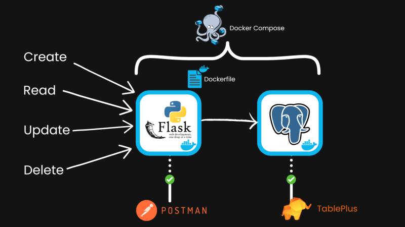

# ECommerce REST API with Flask ,PostgreSQL ,SQLAlchemy  and Docker


[](https://www.postman.com/theoddysey/rest-api-flask-python/collection/4c5nmyt/rest-api-flask-python)


A robust RESTful API developed using Flask, providing comprehensive CRUD functionalities for managing stores, items, and tags, complete with secure user authentication, authorization, and detailed role-based access control. This project serves as an excellent foundation for scalable e-commerce or inventory management systems, leveraging Python's simplicity and the power of RESTful architecture.


## Table of Contents

1. [Overview](#overview)
2. [Core Features](#core-features)
3. [System Requirements](#system-requirements)
4. [Installation](#installation)
   - [Local Setup](#local-setup)
   - [Docker Setup](#docker-setup)
5. [Architecture](#architecture)
6. [API Documentation](#api-documentation)
    - [Items Endpoints](#items-endpoints)
    - [Stores Endpoints](#stores-endpoints)
    - [Tags Endpoints](#tags-endpoints)
    - [User Endpoints](#user-endpoints)
7. [Authentication and Authorization](#authentication-and-authorization)
8. [Error Handling and Validation](#error-handling-and-validation)
9. [Postman Collection](#postman-collection)
10. [Testing](#testing)
11. [Contribution Guidelines](#contribution-guidelines)
12. [License](#license)

## Overview

This project is a production-ready REST API built using Flask, a micro-framework in Python. The API provides a fully-functional backend service for managing stores, items, and tags, complete with comprehensive authentication and authorization layers. It supports user roles and permissions using JWT (JSON Web Tokens), ensuring secure data access.

Designed to be scalable and easily extendable, this API is perfect for both small-scale applications and large-scale microservices architectures.

## Core Features

- **RESTful API Design**: Clean and consistent REST API design patterns are followed, adhering to REST principles.
- **CRUD Operations**: Robust support for Create, Read, Update, and Delete operations on stores, items, and tags.
- **Authentication and Authorization**: Secure user authentication with JWTs, providing access control for protected routes.
- **Tag Management System**: Advanced tagging capabilities for categorizing and linking items in stores.
- **Error Handling**: Comprehensive error handling with custom error messages and HTTP status codes.
- **Data Validation**: Input validation using `marshmallow` schema for all endpoints to ensure data integrity.
- **Extensible Architecture**: Modular code structure with clear separation of concerns, making it easy to extend.
- **Database Integration**: Uses SQLAlchemy for ORM, with SQLite as the default database (easily configurable for other DBs).
- **Containerized Deployment**: Docker support for easy deployment and scaling in different environments.

## System Requirements

- **Python**: 3.7 or higher
- **Flask**: 2.0 or higher
- **pip**: Package manager for Python
- **Docker**: 20.10 or higher (if using Docker)
- **Postman**: For API testing and development

## Installation

### Local Setup

#### 1. Clone the Repository

Clone the repository to your local machine using the following command:

```bash
git clone https://github.com/TheODDYSEY/Rest-api-flask-python.git
cd Rest-api-flask-python
```

#### 2. Create and Activate a Virtual Environment

It's best practice to use a virtual environment to manage dependencies:

```bash
python3 -m venv venv
source venv/bin/activate  # On Windows use `venv\Scripts\activate`
```

#### 3. Install the Required Dependencies

Install all required dependencies using the provided `requirements.txt` file:

```bash
pip install -r requirements.txt
```

#### 4. Run Database Migrations

Ensure that the database is set up properly:

```bash
python manage.py db init
python manage.py db migrate
python manage.py db upgrade
```

#### 5. Start the Flask Application

Start the application on your local development server:

```bash
python run.py
```

The API is now accessible at `http://127.0.0.1:5000`.

### Docker Setup

The project includes a `Dockerfile` for containerized deployment. Docker allows you to run the application in an isolated environment, ensuring consistency across different development and production setups.

#### 1. Build the Docker Image

Navigate to the project root directory and build the Docker image:

```bash
docker build -t flask-rest-api .
```

#### 2. Run the Docker Container

Run the Docker container from the built image:

```bash
docker run -p 80:80 flask-rest-api
```

The API will be accessible at `http://localhost:80`.

#### Dockerfile Explanation

The provided `Dockerfile` is optimized for a lightweight production environment:

```Dockerfile
FROM python:3.10
WORKDIR /app
COPY ./requirements.txt requirements.txt
RUN pip install --no-cache-dir --upgrade -r requirements.txt
COPY . .
CMD ["gunicorn", "--bind", "0.0.0.0:80", "app:create_app()"]
```

- **Base Image**: Uses the official Python 3.10 image.
- **Working Directory**: Sets `/app` as the working directory.
- **Dependency Installation**: Installs all dependencies from `requirements.txt`.
- **Copy Application Code**: Copies the application code into the container.
- **Run Command**: Uses Gunicorn as the WSGI HTTP server to run the Flask application, binding it to port `80`.

## Architecture

The project follows a modular architecture with the following key components:

- **App Module**: Contains the main Flask application factory, including all configurations and extensions.
- **Models Module**: Contains all SQLAlchemy models representing `Stores`, `Items`, `Tags`, and `Users`.
- **Resources Module**: Contains the RESTful resources for handling HTTP requests and responses.
- **Schemas Module**: Contains Marshmallow schemas for serializing and deserializing JSON data.
- **Services Module**: Handles core business logic and data manipulation.
- **Security Module**: Handles JWT token creation, validation, and user authentication.

## API Documentation

The API supports CRUD operations across several entities. Below are detailed descriptions of the endpoints:

### Items Endpoints

- **GET /item**: Retrieve a list of all items.
  - **Request**: `GET /item`
  - **Response**: Returns a JSON array of all items.

- **POST /item**: Create a new item.
  - **Request**: `POST /item`
  - **Headers**: `Authorization: Bearer <token>`
  - **Body**:
    ```json
    {
      "name": "Table",
      "price": 17.99,
      "store_id": 1
    }
    ```
  - **Response**: Returns the created item details.

- **PUT /item/{id}**: Update an existing item by its ID.
  - **Request**: `PUT /item/1`
  - **Headers**: `Authorization: Bearer <token>`
  - **Body**:
    ```json
    {
      "name": "Another Chair",
      "price": 20.50,
      "store_id": null
    }
    ```
  - **Response**: Returns the updated item details.

- **DELETE /item/{id}**: Delete an item by its ID.
  - **Request**: `DELETE /item/1`
  - **Headers**: `Authorization: Bearer <token>`
  - **Response**: Returns a success message.

### Stores Endpoints

- **GET /store**: Retrieve a list of all stores.
  - **Request**: `GET /store`
  - **Response**: Returns a JSON array of all stores.
  
- **POST /store**: Create a new store.
  - **Request**: `POST /store`
  - **Body**:
    ```json
    {
      "name": "My Store 3"
    }
    ```
  - **Response**: Returns the created store details.

- **DELETE /store/{id}**: Delete a store by its ID.
  - **Request**: `DELETE /store/1`
  - **Headers**: `Authorization: Bearer <token>`
  - **Response**: Returns a success message.

### Tags Endpoints

- **POST /store/{id}/tag**: Create a new tag for a store.
  - **Request**: `POST /store/1/tag`
  - **Body**:
    ```json
    {
      "name": "Tag name"
    }
    ```
  - **Response**: Returns the created tag details.

- **GET /tag/{id}**: Retrieve information about a tag by its ID.
  - **Request**: `GET /tag/1`
  - **Response**: Returns the details of the tag.

### User Endpoints

- **POST /register**: Register a new user.
  - **Request**: `POST /register`
  - **Body**:
    ```json
    {
      "username": "newUser",
      "password": "password123"
    }
    ```
  - **Response**: Returns a success message with user details.

- **POST /login**: Authenticate a user and generate a JWT.
  - **Request**: `POST /login`
  - **Body**:
    ```json
    {
      "username": "newUser",
      "password": "

password123"
    }
    ```
  - **Response**: Returns a JWT for subsequent requests.

## Authentication and Authorization

The API uses JWT (JSON Web Tokens) for authentication and authorization. JWTs are generated during user login and must be included in the `Authorization` header for protected endpoints.

## Error Handling and Validation

The API follows robust error handling mechanisms using Flask's error handler methods. Input validation is handled using `marshmallow` schemas to ensure data integrity and proper response formatting.

## Postman Collection

To facilitate easy testing and development, a Postman collection is included in the repository. It contains all API endpoints, sample requests, and responses.

- [Access the Postman File ](https://www.postman.com/theoddysey/rest-api-flask-python/collection/4c5nmyt/rest-api-flask-python)

## Testing

Unit tests are written using Python's built-in `unittest` module. To run the tests:

```bash
python -m unittest discover -s tests
```

## Contribution Guidelines

Contributions are welcome! Please fork the repository and submit a pull request for review.

## License

This project is licensed under the MIT License.
